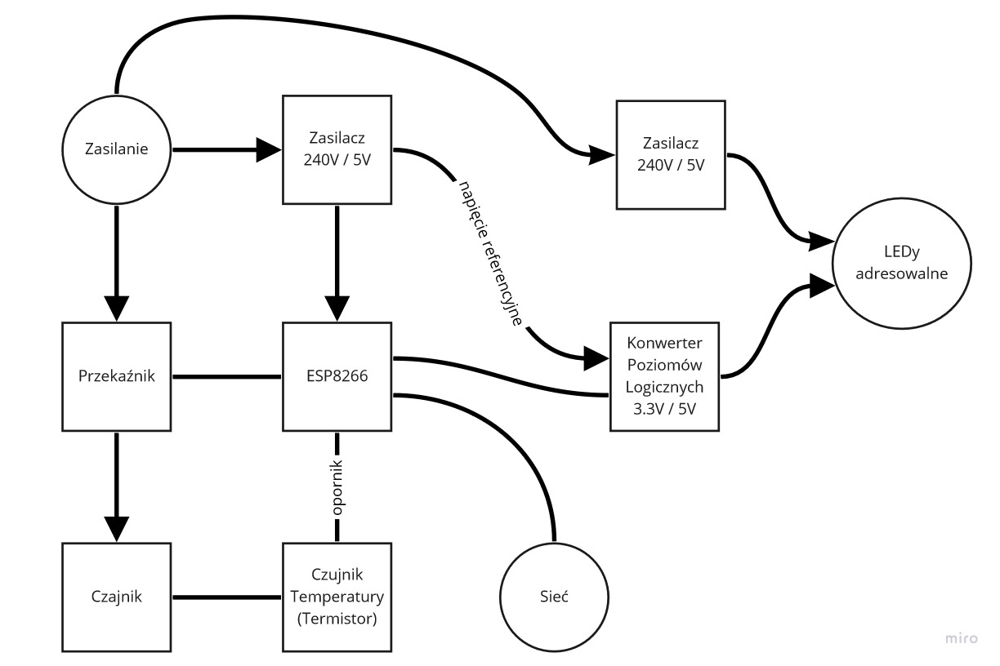

# OiAK-Projekt   Ulepszenia prostych przyborów domowych - Czajnik

Link do repozytorium:
<https://github.com/Byczax/OiAK-Projekt>

|      Wydział elektroniki       |  Kierunek: informatyka techniczna |
|:-------------------------------|------------------------:|
| Grupa zajęciowa: Wt 7:30       | Semestr: 2020/2021 Lato |
| Prowadzący:                    | dr inż. Dominik Żelazny |

| Autorzy         |
|:---------------:|
| Byczko Maciej   |
| Zuzanna Jasińska|

## Wstęp

Nasz projekt ma na celu ulepszenie prostego urządzenia domowego w naszym przypadku czajnika.
Moduły które chcemy zaimplementować:

- Bezprzewodowa komunikacja przez moduł WiFi (4 tygodnie)
- Pomiar temperatury (wyliczanie z oporu termistora) (2 tydzień)
- Uruchamianie za pomocą strony internetowej (3-4 tygodnie)
- Otrzymywanie powiadomień o wykonanej akcji (Zagotowanie się wody), (1 tydzień)
- Podświetlenie led zmieniające barwę w zależności od temperatury wody (dodatkowe, 2 tygodnie)
- Czujnik pojemności czajnika (dodatkowe, pływak bądź czujnik laserowy???)

## Potrzebne elementy

### Podzespoły

- Mikrokontroler, w naszym przypadku esp8266
- Czujnik temperatury (Thermistor)
- Taśma LED wraz z potrzebnymi komponentami (Zasilacz, kontroler)

### Oprogramowanie

Strona internetowa:

- HTML
- CSS
- Framework (Opcjonalny, jeżeli chcemy rozbudować stronę o np. zakładkę z wykresami temperatur potrzebnych do zaparzania herbat, śledzenia ilości wody ugotowanej przez miesiąc użytkowania)

Mikrokontroler:

- język C
- Wstawki z assemblerem za pomocą bloku asm{ }

## Plan działania

- Narysowanie schematu logicznego działania
- Narysowanie schematu elektronicznego
- Uruchomienie esp8266
- Odczytywanie wartości z czujnika
- Podłączenie esp do przekaźnika
- Podłączenie czajnika
- Połączenie z serwerem (stroną internetową)
- Połączenie LEDów

## Początkowy zarys

## **Podział programu**

## ESP8266

- odczytywanie pomiaru czujnika temperatury (termistor)
- przeliczanie oporu na wartość temperatury
- Konwersja danych na pakiety do przesłania
- Komunikacja wifi
- przełączanie przekaźnika

### Dodatkowe opcje

- przeliczanie temperatury na kolor LEDów
- Sterowanie LED

## Strona internetowa

- Pokazanie temperatury
- Przycisk włącz/wyłącz
- Regulacja temperatury
- Powiadomienia

### Dodatkowe informacje

- Wykresy temperatur do np. zaparzania herbaty
