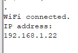

# 1. OiAK - Projekt </br> Zdalny pomiar temperatury

| Wydział elektroniki      | Kierunek: informatyka techniczna |
| :----------------------- | -------------------------------: |
| Grupa zajęciowa: Wt 7:30 |          Semestr: 2020/2021 Lato |
| Prowadzący:              |          dr inż. Dominik Żelazny |

|     Autorzy      |
| :--------------: |
|  Byczko Maciej   |
| Zuzanna Jasińska |

## 1.1. Spis treści

- [1. OiAK - Projekt </br> Zdalny pomiar temperatury](#1-oiak---projekt-br-zdalny-pomiar-temperatury)
  - [1.1. Spis treści](#11-spis-treści)
  - [1.2. Wstęp](#12-wstęp)
    - [1.2.1. Wykorzystane narzędzia](#121-wykorzystane-narzędzia)
      - [1.2.1.1. Języki programowania](#1211-języki-programowania)
      - [1.2.1.2. Narzędzia informatyczne](#1212-narzędzia-informatyczne)
  - [1.3. Układ elektroniczny](#13-układ-elektroniczny)
  - [1.4. Układ fizyczny](#14-układ-fizyczny)
  - [1.5. Wykorzystane biblioteki](#15-wykorzystane-biblioteki)
  - [1.6. Pomiar temperatury](#16-pomiar-temperatury)
  - [Lampka LED](#lampka-led)
  - [1.7. Podłączenie do WIFI](#17-podłączenie-do-wifi)
  - [1.8. Strona internetowa](#18-strona-internetowa)
    - [1.8.1. Wygląd strony internetowej](#181-wygląd-strony-internetowej)
  - [1.9. Wnioski](#19-wnioski)
  - [1.10. Bibliografia](#110-bibliografia)

## 1.2. Wstęp

Nasz projekt miał na celu wykonać zdalny pomiar temperatury w czajniku na podstawie termistora (termometru oporowego).

### 1.2.1. Wykorzystane narzędzia

#### 1.2.1.1. Języki programowania

- C++
  - Główna struktura projektu
  - Komunikacja wifi
  - Odczyt temperatury
- HTML (inline)
  - Wyświetlenie pod przypisanym adresem strony z wynikiem pomiaru

#### 1.2.1.2. Narzędzia informatyczne

- PlatformIO
  - Uruchamianie kodu na podłączonym mikrokontrolerze
- Visual Studio Code
  - Uruchomienie środowiska PlatformIO
- Github
  - Narzędzie wykorzystane do współpracy zdalnej

## 1.3. Układ elektroniczny


## 1.4. Układ fizyczny


## 1.5. Wykorzystane biblioteki

- `ESP8266WiFi.h` - Pozwala na komunikację wifi, możliwość stworzenia także z urządzenia access pointa
- `NTPClient.h` - Odczytanie czasu rzeczywistego
- `WiFiUdp.h` - Ustawianie stałego ip oraz protokoły przesyłania

## 1.6. Pomiar temperatury

Aby wyliczyć temperaturę mierzoną przez termistor musieliśmy skorzystać ze wzorów zamieszczonych w dokumentacjach, aby się zgadzała charakterystyka zależności oporu do temperatury


```cpp
double Volt, Rth, temperature, adc_value; // variable declaration

adc_value = analogRead(A0); // get measurement
Volt = (adc_value * VCC) / adc_resolution; // calculate measurement to volt
Rth = (VCC * R2 / Volt) - R2; // calculate volt to resistance

/*  Steinhart-Hart Thermistor Equation:
*  Temperature in Kelvin = 1 / (A + B[ln(R)] + C[ln(R)]^3)
*  where A = 0.001129148, B = 0.000234125 and C = 8.76741*10^-8  */
temperature = (1 / (A + (B * log(Rth)) + (C * pow((log(Rth)),3))));   // Temperature in kelvin

temperature = temperature - 273.15;  // Temperature in degree celsius
```

Większość wzorów jest oparta na jednostce `Kelvin` przez co musieliśmy zastosować konwersję na <sup>o</sup>C.

## Lampka LED

Wbudowana lampka LED w ESP8266 znajduje się pod portem 4 GPIO i możemy nią sterować za pomocą przycisku, który wyświetla się na stronie internetowej, pokazujemy za pomocą tego że możemy w zależności od nas sterować danym LEDem i np. w przyszłości zrobić np. migające powiadomienie gdy będzie temperatura ustalona przez nas.

## 1.7. Podłączenie do WIFI

Komunikacja WIFI była wyzwaniem gdyż było bardzo dużo problemów ponieważ nie chciała działać w języku C, przez co zostaliśmy zmuszeni do przejścia na język C++ gdzie mogliśmy zawrzeć potrzebną nam bibliotekę `ESP8266WiFi.h` która pozwala na utworzenie topologii siatki sieciowej.
Wykorzystaliśmy z niej możliwość stworzenia z esp8266 stacji pomiarowej + hosting strony.


```cpp
// Connect to Wi-Fi network with SSID and password
  Serial.print("Connecting to "); // connecting information
  Serial.println(ssid); // find and connect to wifi with name under ssid variable
  WiFi.begin(ssid, password);// try to connect to ssid with given password
  while (WiFi.status() != WL_CONNECTED) // indicator that we trying to connect
  {
    delay(500);
    Serial.print(".");
  }
```

Do strony internetowej podłączamy się pod ip które zostanie pokazane w konsoli



Należy pamiętać aby wprowadzić w kodzie nazwę urządzenia (routera) do którego chcemy się podłączyć

```cpp
const char *ssid = "<TUTAJ NAZWA WIFI>";
const char *password = "<TUTAJ HASŁO WIFI>";
```

## 1.8. Strona internetowa

Strona została napisana w czystym HTML wraz z inline CSS, musieliśmy tak to zrobić ponieważ możemy załadować na esp8266 tylko jeden plik przez co wszystko musi być "inline", więc gdy upewniliśmy się że strona internetowa działa w wersji `.html` to przenieśliśmy ją do kodu w `.cpp` i wypisywaliśmy ją za pomocą:

```cpp
client.println("<tutaj linia kodu html>");
```

### 1.8.1. Wygląd strony internetowej


## 1.9. Wnioski

Projekt był bardzo dużym wyzwaniem ponieważ po raz pierwszy mieliśmy styczność z mikrokontrelami, podzespołami użytymi do zbudowania schematu, potrzebowaliśmy do tego pomocy specjalisty.
Także narzędzia informatyczne były nowością, sam kod był pisany głównie w C++ którego uczyliśmy się równolegle z tym kursem.

Przeszkodą dla wiedzy okazał się limit plików (1) na urządzeniu przez co wszystko poza C++ należało pisać "inline".

## 1.10. Bibliografia

<https://docs.espressif.com/projects/esp8266-rtos-sdk/en/latest/get-started/index.html#connect>

<https://www.espressif.com/sites/default/files/documentation/2c-esp8266_non_os_sdk_api_reference_en.pdf>

<https://www.espressif.com/sites/default/files/documentation/esp8266-technical_reference_en.pdf>

<https://create.arduino.cc/projecthub/iasonas-christoulakis/make-an-arduino-temperature-sensor-thermistor-tutorial-b26ed3>

<https://esp8266tutorials.blogspot.com/2016/09/esp8266-ntc-temperature-thermistor.html>
